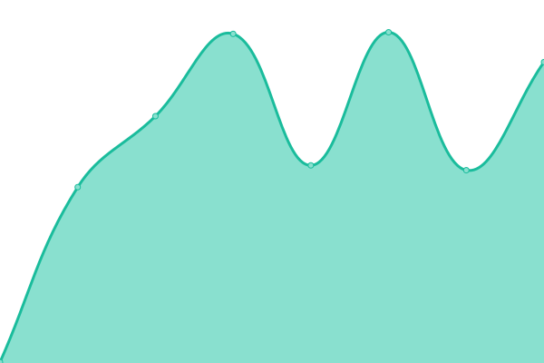

# d-party-Upptime

[📈d-party.net Status](https://d-party.github.io/d-party-Upptime/): <!--live status--> **🟩 All systems operational**

このリポジトリは[Upptime](https://upptime.js.org)によって[d-party](https://d-party.net)を監視するためのリポジトリです。

<!--start: status pages-->
<!-- This summary is generated by Upptime (https://github.com/upptime/upptime) -->
<!-- Do not edit this manually, your changes will be overwritten -->
<!-- prettier-ignore -->
| URL | Status | History | Response Time | Uptime |
| --- | ------ | ------- | ------------- | ------ |
|  [d-party](https://d-party.net) | 🟩 Up | [d-party.yml](https://github.com/d-party/d-party-Upptime/commits/HEAD/history/d-party.yml) | 

 940ms
     
 | 

<a href="https://d-party.github.io/d-party-Upptime/history/d-party">100.00%</a>
    

|  [d-party - Chrome ウェブストア](https://chrome.google.com/webstore/detail/d-party/ibmlcfpijglpfbfgaleaeooebgdgcbpc) | 🟩 Up | [d-party-chrome.yml](https://github.com/d-party/d-party-Upptime/commits/HEAD/history/d-party-chrome.yml) | 

 324ms
     
 | 

<a href="https://d-party.github.io/d-party-Upptime/history/d-party-chrome">99.78%</a>
    

|  [dアニメストア](https://animestore.docomo.ne.jp/animestore/tp_pc) | 🟩 Up | [d.yml](https://github.com/d-party/d-party-Upptime/commits/HEAD/history/d.yml) | 

 1045ms
     
 | 

<a href="https://d-party.github.io/d-party-Upptime/history/d">100.00%</a>
    

<!--end: status pages-->

[**Visit our status website →**](https://d-party.github.io/d-party-Upptime/)

## 📄 License

- Powered by: [Upptime](https://github.com/upptime/upptime)
- Code: [MIT](./LICENSE) © [Upptime](https://upptime.js.org)
- Data in the `./history` directory: [Open Database License](https://opendatacommons.org/licenses/odbl/1-0/)
